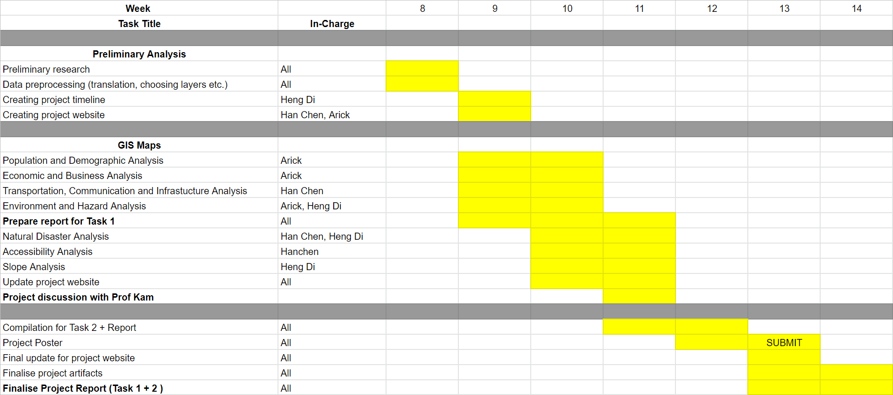

```{r setup, include=FALSE}
knitr::opts_chunk$set(echo = FALSE)
```


## Motivation 


## Project objective

As part of the plan, part of Kutai Kartanegara Regency (Kabupaten Kutai Kartanegara) and Penajam North Paser Regency (Kabupaten Penajam Utara) in East Kalimantan will be carved out to create a new province-level planned city, and the capital will be relocated to a more central location within Indonesia. The plan is part of a strategy to reduce developmental inequality between Java and other islands in the Indonesian archipelago and to reduce Jakarta’s burden as Indonesia’s primary hub. President Joko Widodo, known as Jokowi, said the relocation will help spread economic activities outside of the most-populous island of Java and narrow its income gap with the rest of the country.

### Task 1


### Task 2

## Data
Given datasets :

+ [Batas Desa & Data Kependudukan Tahun 2019 Seluruh Indonesia](https://www.indonesia-geospasial.com/2020/04/download-shapefile-shp-batas-desa.html).  This data set provides comprehensive population data at the sub-district level.  In Indonesia local language, they are known as **kota** (i.e. urban sub-district) and **desa** (i.e. rural sub-district).  You are required to download data set for Provinsi Kalimantan Timur (i.e. East Kalimantan Province).
+ [Rupa Bumi Iindonesia (RBI) Provinsi Kalimantan Timur Perwilayah (Kabupaten/Kota)](https://www.indonesia-geospasial.com/2020/01/shp-rbi-provinsi-kalimantan-timur.html). The term rupabumi means topographic.  This data repository provides a coprehensive collection of topographical data layers of East Kalimantan. You are required to download data of Kota Balikpapan, Kota Samarinda, Penajam Paser Utara and Kutai Kartanegara.
+ [DEM SRTM 30m](https://www.indonesia-geospasial.com/2020/01/download-dem-srtm-30-meter-se-indonesia.html), digital elevation model at 30m resolution.
+ [Geological data](https://www.indonesia-geospasial.com/2020/03/download-data-shapefile-shp-geologi-se.html) layer.
+ [Forest fire hot spot data](https://www.indonesia-geospasial.com/2020/04/shapefile-shp-titik-api-hotspot.html). This repository provides several years of forest hot spots data.
+ [Buildings and Settlements](https://www.indonesia-geospasial.com/2020/12/download-shp-pemukiman-detail-seluruh.html).

Additional dataset : 


## Scope of work

The project will comprise of, but not limited to the followings steps:

- Selection of project area, this year the project area is provided.
- Data collection, extraction, integration, transformation and wrangling.
- Designing and building GIS model and database
- Preparing report of survey
- Performing site suitability analysis by integrating GIS and multi-criteria evaluation methods.
- Preparing site suitability analysis report including detail discussion of the analysing method used.
- Preparing poster and project webpage.


## Project schudule (Gannt chart)

```{r}

```


moo moo moo

Updated 12.30am

Update again....

