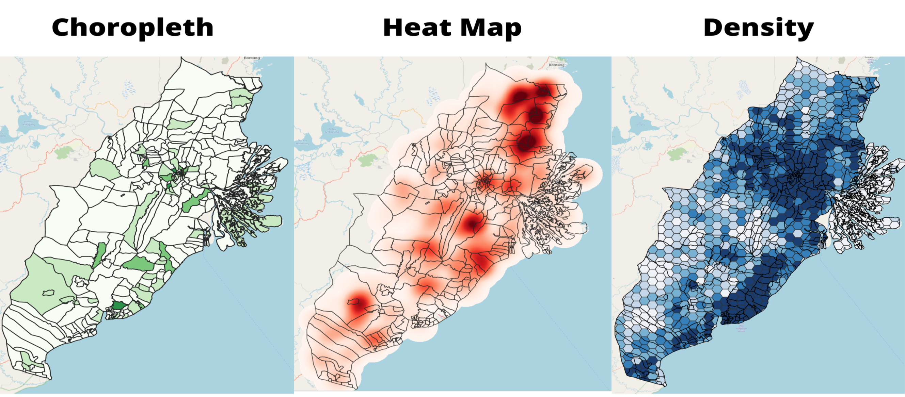
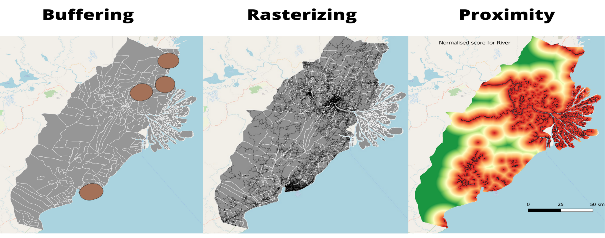
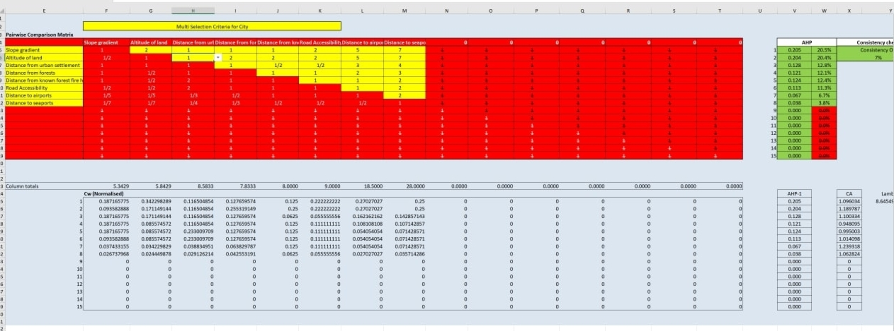
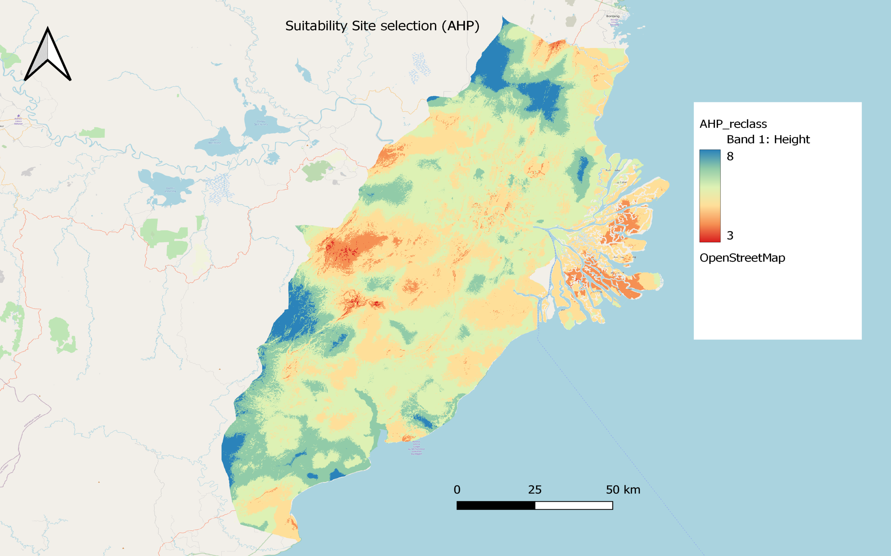

```{r setup, include=FALSE}
knitr::opts_chunk$set(echo = FALSE)
```

# Introduction
We are budding GIS Analyst preparing a study for the planned new capital city as a budding GIS Analyst for a multinational urban and regional planning consulting firm. The goal of this research is to create a GIS for the planned future capital area. The study incorporates open government data and other open source data sets into a GIS-Enabled Urban Planning Support System. Using relevant real-world data, the study collects, processes, and analyzes geographically connected concerns.

## Objectives
1. Prepare a report of survey to be submitted to the National Development Planning Agency (abbreviated Bappenas) on the analysis of the proposed Study Area

2. Use GIS analysis and multi-criteria evaluation method to identify site suitability for the proposed new capital city according to the proposed Research Criteria.

# Methods
* The methods used were GIS analytical tools such as:
  + Preparing qualitative and quantitative thematic maps.
  + Preparing Choropleth Maps
  + Preparing Heatmap Maps 
  + Preparing Overlay Maps
  + Preparing Density Maps
  + Preparing Proximity Maps
  + AHP Criteria for Rationalisation

# Results

Task 1: Conclusion

```{r}

```

In task 1, we identified and analysed the study area on key factors such as, Population and Demographic, Economic and Businesses, Transport and Communication , Infrastructures and Environment and Hazards. Overall, the survey found several strategic sites given the rich agricultural and economic activities. However, many considerations will still need to be taken into account, which will be done in task 2.  

Task 2: Conclusion

```{r}

```

In task 2, following a list of criteria, we further create buffers, rasters and proximity maps to mark out areas that are deemed not suitable. We further utilise Raster-based GIS Multiple‐Criteria Decision Analysis (GIS-MCDA), which integrates raster-based GIS modelling as well as the Analytical Hierarchical Process to further identify our study area.

AHP Criteria

```{r}

```

The prioritization of issues were ranked together after the team had come up with various on secondary research sources. The most important factor we agreed on was the gradient of the slope, because of there were many consequences of disregarding slope, and the economic costs involved.

Site Selection

```{r}

```

Site selection overview:
* It does not have steep slope or is close to rivers or coastline and hence would not be susceptible to flooding.
+ It is one of the few areas with low incidences of forest fire, and also would have less environmental destruction because the locations of forests are not there.
+ While it is far away from seaports they are not weighted highly in our analysis, and there are 2 existing airports which can be redeveloped for the capital’s needs, and one more international airport that serves Samarinda.

# Next Steps

Aliquam sed faucibus risus, quis efficitur erat. Vestibulum semper mauris quis tempus eleifend. Aliquam sagittis dictum ipsum, quis viverra ligula eleifend ut. Curabitur sagittis vitae arcu eget faucibus. In non elementum felis. Duis et aliquam nunc. Nunc pulvinar sapien nunc, vel pretium nisi efficitur in. Fusce fringilla maximus leo et maximus. Fusce at ligula laoreet, iaculis mi at, auctor odio. Praesent sed elementum justo. Aenean consectetur risus rhoncus tincidunt efficitur. Praesent dictum mauris at diam maximus maximus [@R-posterdown].

# Conclusion

Try `posterdown` out! Hopefully you like it!

```{r, include=FALSE}
knitr::write_bib(c('knitr','rmarkdown','posterdown','pagedown'), 'packages.bib')
```

# References
