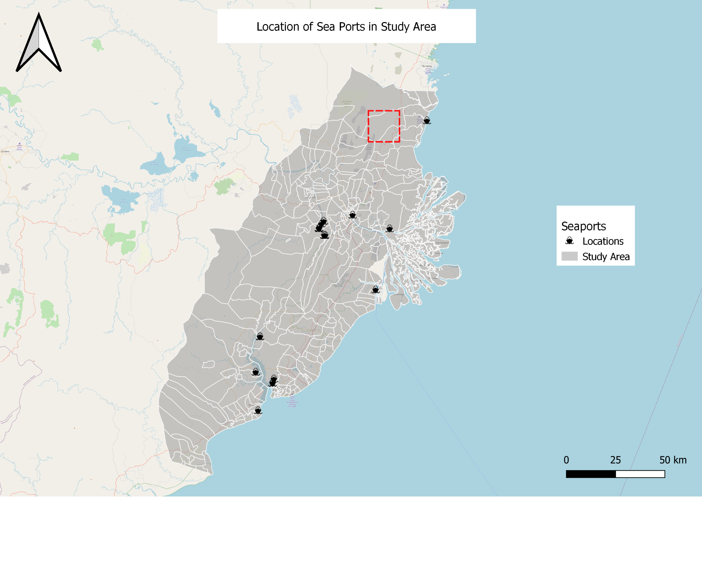

# GIS Report

Based on the analyses conducted as explained above, we believe that the areas in light green would be suitable areas for the new capital city of Indonesia, and we have come to the final decision of the area north of Samarinda, highlighted in dark green.

This area is relatively flat and away from the flood-prone part of Samarinda, while also not being near forested land, both dry shrubs and primary and secondaary forest layers, or any forest fires. In addition, it is also close to two airports that have the potential for expansion, as well as being close to an existing major settlement (Samarinda).

We acknowledge that this differs from various online sources that have rumoured the new city to be between Balikpapan and Samarinda. While we are unsure of the exact rationale behind their decision to locate the new capital between Balikpapan and Samarinda, based on the evidence that we have gathered, and the weights we put on different factors, we believe that our weightage of environmental risks would be relatively higher. Our exact rationale and report is outlined as follows.

To get to this conclusion,

# Methods

We had used Raster-based GIS Multiple‐Criteria Decision Analysis (GIS-MCDA), which integrates raster-based GIS modelling as well as the Analytical Hierarchical Process.

## 1. Results from Raster-based GIS modelling

The 8 criteria that were set out on the project brief were, quoted verbatim:
> It should be between 4500-5500 hectares in size

The decision criteria should be in such a way that the threshold allows for at least a 4500 to 5500 hectare area to be selected. This would work out to approximately a 5km x 5km area assuming the site is shaped like a square.

> It should avoid steep slope. Steep slope developments are relative more costly because they involve cut-and-fill and is less  environmental friendly.

From the DEM layer, the gradient of the land was calculated. Areas with lower gradient scored higher, and areas with a steeper gradient scored lower. The elevation itself was excluded from the analysis, as it is the change in elevation, rather than the absolute elevation, that matters. 


Most of the terrain is rlatively flat and thus scores very well. Looking to the southwest of the map, there are a few areas that are deemed more unsuitable because of the hilly terrain, as further inland west into the study area, it starts to get into mountaineous territory. As it is linked to an increase in construction costs, this area might a potential concern.

> It should be away from potential natural disaster risk areas such as sea coasts, major rivers and volcanoes.

As stated in the site survey analysis from task 1, there are no major volcanoes in the study area, therefore they were not incorporated into the analysis. The major areas of consideration were the sea coast and the 2 major rivers, the Mahakam River and the Balikpapan Bay, which a buffer region was implemented. The smaller regions in the study area did not have a buffer.


As can be seen, the major areas of concern are the area near the Mahakam River and the associated streams surrounding it. However, as the river cover as a percentage of the study area is not very large, there still is a high proportion of area that is still suitable, going by this criteria alone.

> It should be near to current urban settlement areas but not at the current major settlement areas.

Similarly, only urban settlement areas were considered in the analysis. Therefore, being close to any settlement areas outside of Samarinda and Balikpapan city limits would not negatively impact the site suitability score.


As we are unable to build exactly on the urban settlement, the region that is exactly on the settlement is classed as 0. Increasingly, it is obvious that most areas of the map score higher than 0.5, due to their proximity to the large cities of Balikpapan and Samarinda with the suitability falling as the distance increases.

> It should avoid natural forest as much as possible.

Natural forests from the data include Primary and Secondary Dry and Wet Forests, Primary and Secondary Mangrove Forests, Secondary Swamp Forests and shrubbery. Although a check on internet websites show that majority of the land in Samarinda had already been deforested,  including the land labelled as “Shrubbery”, we decided to go with a more conservative estimate and include shrubbery in our data analysis, as we would want to avoid those areas as much as possible to preserve whatever natural vegetation there is left.


Much of the map area is covered in forest, except for some narrow strips on the west and in the north of the study area. Although not all of it is primary forest as there has been a large scale of deforestation, we believe that due to the urgent need to restore forests in East Kalimantan province, as well as to avoid developing on natural areas as much as possible, we have been rather conservative in our estimates.

> It should avoid areas prone to forest fire.

Due to climate change, deforestation and poor forest management, the impact of forest fires on potential land suitability sites has gotten stronger. We have identified a 2km buffer around the forest fire in order to ensure a sufficient margin of safety.


Unsurprisingly, where there are forests in the above picture, there are also high occurrences of forest fires. The only areas where this does not occur, are close to the mountaineous regions in the West and the North. The coastal areas seem to be more prone to forest fires as can be seen from the higher density of points, but given that many forest fires in Indonesia are actually man-made, this could be a plausible explanation. 

> It should be highly accessible via road transport.


Most areas score well on this, because of a wide variety of roads tht can see further development to support the capital city. Again, the exception is in the more mountaineous regions in the Southwest of the study area, and some regions between Balikpapan and Samarinda.

> It should be near to airport(s) and seaport(s).


A 3km buffer was constructed outside of the airport to account for noise abatement limitations. Even so, most of the study area near the coastal areas are highly accessible to airports, with the exception of the area exactly between Balikpapan and Samarinda. The South of the study area has access to only one airport (Balikpapan Airport) while there are 3 airports in the north. Further research and surveys done in task 1 found that 2 of those 3 airports are either decommissioned or very lightly utilised. However, they could still be refurbished without incurring excessive capital expenditure if the situation calls for it, instead of contructing a new airport.

Seaports are located closest to the rivers, but the presence of river proximity would work against them contributing significantly favourably to the site selection.

# 2. AHP Selection Matrix 

Based on secondary research sources, our team has identified the prioritisation of issues as follows:


1. Gradient of slope – 20.5%

2. Distance from river – 20.4%

3. Distance from known forest fire hotspots – 12.4%

4. Road accessibility – 11.3%

5. Distance from forests – 12.1%

6. Distance from urban settlements – 12.8%

7. Distance to Airport – 6.7%

8. Distance to seaport – 3.8%


# 2.1 Reasoning for Ranking

The gradient of the slope was designated as the most significant criteria, because of the consequences of disregarding slope, and the economic costs involved with it. Construction on slopes have issues with construction of foundations and excavation of soil, as compared to flat land. This  could lead to an increase in cost of construction of as much as 40%, as compared to building on flat land. Given that the city is supposed to be constructed from scratch, and the study area has plenty of other areas which are not as steeply sloped, it reasons that there would be a significant amount of alternative sites to be selected. Furthermore, building on slopes could have long-term consequences such as an increased risk of natural disasters such as landslides, especially when poor drainage systems and inadequate construction materials are involved.  As such, slope gradients would obtain the highest weightage in our model, due to its cost outlays and potential risk for introducing new disasters post-build.

Second is the distance from river or major coastlines. The main rationale for moving the capital city away from Jakarta is due to its proximity to the coastline and the type of soil leading to the city being susceptible to floods and sinking, compounded by its traffic management problems which make natural disaster management and mitigation more complicated. Therefore, it is essential that the new site avoids this possibility to the fullest extent otherwise it would defeat the purpose of building the city there in the first place. This is compounded by there being regular floods in the Mahakam River, to the extent that there are rice paddies built in the surrounding areas to take advantage of this. Given the systemic problems that the municipal governments face, such as a lack of leadership and political will to tackle the flooding platform, the unwillingness of people to relocate worship facilities near flooded areas, and the sheer amount of people to relocate ,  it is important that these issues are avoided entirely. Thus, river / coast proximity also get a high weightage.

The next few factors are related to the proximity to known forest fire hotspots, the road accessibility and distance from forests, all of which receive relatively similar weightage. Forest fires can certainly have disastrous effects on the city, but it is possible to mitigate their effect through a comprehensive road network, and other methods like building small and simple canals. These canals can be done on existing agricultural land and ditches to act as firebreaks, which has been done in Kalimantan province already.  

Similarly important factors, however, are to ensure a comprehensive road network, which would facilitate forest fire mitigation methods, and avoidance of areas that are near the forest in the first place, as these areas have the potential to become fire risk areas especially if deforestation occurs. This would be secondary to actually avoiding forest fire prone areas in the first place, as road infrastructure can and will be built as the city expands.

Including the shrubbery layer in the forest layer was important to the analysis, because literature has discovered that the nature of these low density shrubs are dry vegetation, which are at the greatest risk of triggering forest fires.  Furthermore, there is a need to build in resilience to the future capital city by reducing the incentive for deforestation as much as possible, since the more fire-resistant primary forests areas have been greatly reduced as a result of deforestation. It is estimated that only 3% of peatlands are still fire-resistant primary forest, and researchers advocate for their protection to the fullest extent. 

The last two factors, our team believes, are “good-to-haves”. The distance to airport is measured at only 7%, because of the availability of alternatives like the 2 major airports at Balikpapan and Samarinda, which already have established air networks. While it is not unusual to have airports that are a long way from the city centre, for example Beijing Capital Airport is almost 30km away from downtown and Pudong Airport at 45km, it is still weighted above the seaport due to its importance in attracting investment and convenience for visiting dignatories. As the size selection is only 4500-5500 hectares, it is also unlikely that there would be an economic case for a construction of an entirely new airport to solely serve the capital. However, relative to the environmental concerns that any proposed development in Kalimantan needs to contend with, we believe that land and sea port proximity is relatively less important. 

# 3. Implementing the Analysis


Based on the analysis, several areas, mostly clustered around the regions in the north and southwest, have been identified as suitable locations. Based on a threshold value of 0.6 as acceptable, the suitable sites are outlined in green.

We have identified the most suitable site there. Although it does not score the highest on the scale, areas that score 9 or 10 are significantly smaller and do not fit the 4500 to 5500 hectare definition that is required of the location. Furthermore, although the mountaineous area at the southwest of the study do quite well, it is likely that in order to get to that area in the first place, one would still need to traverse steep slopes, which would expense time and resources.

In view of the size constraints, therefore, we believe that the chosen area would be the most suitable.

- It does not have steep slope or is close to rivers or coastline and hence would not be susceptible to flooding.
- It is one of the few areas with low incidences of forest fire, and also would have less environmental destruction because the locations of forests are not there.
- While it is far away from seaports they are not weighted highly in our analysis, and there are 2 existing airports which can be redeveloped for the capital's needs, and one more international airport that serves Samarinda.

Selected Site
```{r}

```

## 3.1 Referencing Vector layers

### 3.1.1 Population and Demographic (Density by District)


```{r}

```


```{r}

```


```{r}

```


### 3.1.2 Economic and Businesses

Agriculture

```{r}
knitr::include_graphics("img/k4.png")
```

Mining

```{r}
knitr::include_graphics("img/k5.png")
```

Commerce

```{r}

```


### 3.1.3 Transport and Communication

Airports

```{r}

```

Bus Terminals

```{r}
knitr::include_graphics("img/k8.png")
```

Seaports

```{r}

```

Roads

```{r}
knitr::include_graphics("img/k10.png")
```

```{r}
knitr::include_graphics("img/k11.png")
```

### 3.1.4 Infrastructures

Buildings

```{r}

```

Electricity Network

```{r}

```

Water Supply (distributors)

```{r}

```

### 3.1.5 Environment and Hazard

Forest Fire 

```{r}

```

Earthquake

```{r}

```

Major rivers with digital elevation

```{r}
knitr::include_graphics("img/k17.png")
```

