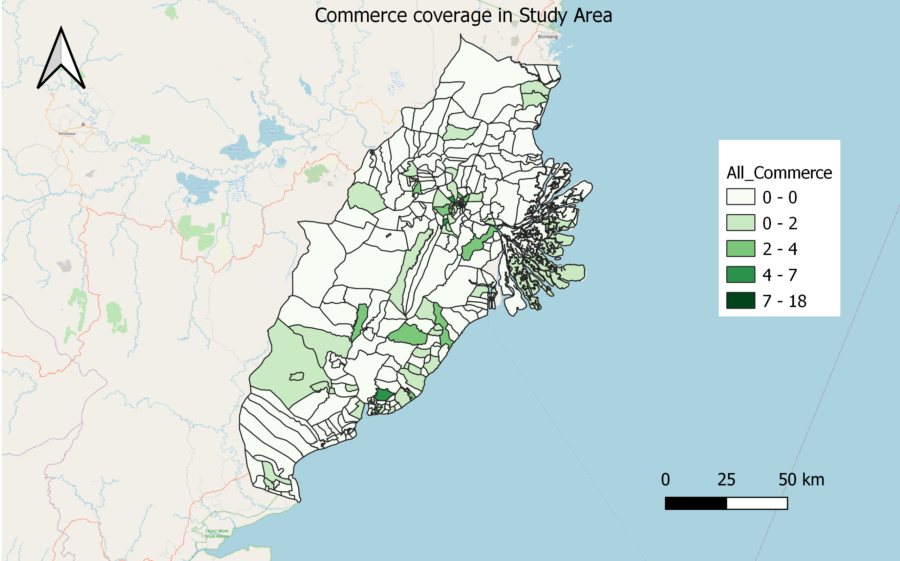
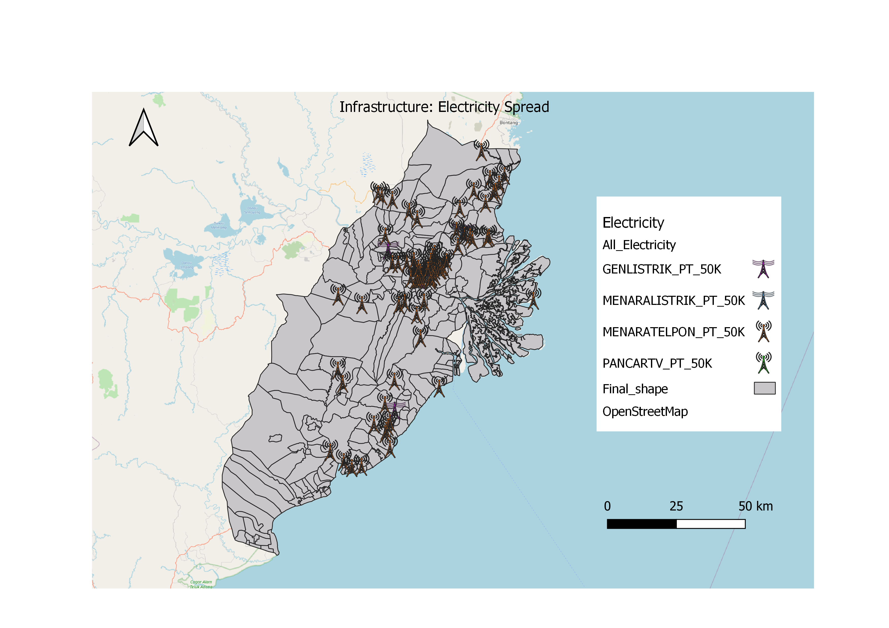
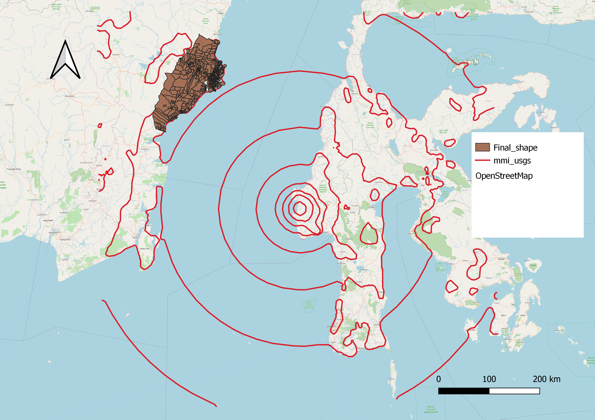

```{r setup, include=FALSE}
knitr::opts_chunk$set(echo = FALSE)
```

# 1. Population and Demographic

## 1.1 Population Density by District


Unsurprisingly the most densely populated areas are located near the urban centres of Samarinda and Balikpapan, with the general trend of areas becoming less densely populated the further inland. However, the area north of Samarinda, and between Balikpapan and Samarinda, stands out as having population density of around 36-125 people per square kilometre. These places have some form of human settlement around them but are not too densely populated indicating the presence of highly urbanised areas.

The region that had the highest proportion of adults are close to Kota Balikpapan, at areas Prapatan (56.7%), Telaga Sari (56.1%), Telemow, Gunungsari Ilir and Damai Baru (all at 56%). Generally, however, as highlighted by the dark green areas, which indicate regions with the highest proportion of adults of 54.5% to 67.7%, most of those areas are clustered near the cities of Samarinda and Kota Balikpapan, while the areas with the smallest proportion of adults, at 46.5% to 50.1%, are located in the outlying regions, for example Santan Ulu in the north of the study region, Tani Baru in the east near the river delta, and Penajam, near the Southwest. These percentages are significant because they provide insight into the demographics of the region - a place with a higher proportion of adults would likely have a larger workforce, after controlling for the population density. Places with higher proportion of seniors or elderly, who are not considered economically productive, would mean more social support needed to empower them, and thus be a less suitable location.


Supplementing the previous point, a survey was also conducted on the proportion of seniors in the study area. It was found that the proportion of seniors ranged from only 1.7% to 11.7%. The highest proportions were found in areas indicated by the dark blue on the map where the proportion ranged from 5.7% to 11.7%. There was no particular geographic distribution for these highest proportions, which were Desa Argo Sari (11.7%), Lung Anai (9.3%), Pelabuhan (8.9%), Sungai Bawang (8.6%) and Bukit Raya (8.5%). Generally, there is also no specific trend in the geographical distribution of seniors, except that most of the areas with more seniors are clustered north of Balikpapan. 


# 2. Economic and Businesses

## 2.1 Agriculture

The overall distribution of agricultural areas is shown as below:


### 2.1.1 Sawah - Integrated Rice or Paddy Field


Agrisawah, or paddy fields, are found mostly within the area of Samarinda as well as Kutai Kartanegara regency, close to the Mahakam River. We hypothesise that the low-lying area, makes it susceptible to floods and thus it becomes a better region to have rice paddies. This contrasts with the relatively higher-lying area in Balikpapan and even south, which would be more suited for conventional crops that do not require an extremely large amount of water.

### 2.1.2 Forest Plantation

Most forest plantations are found within the inner area at higher elevation, possibly because they take longer to grow and are more vulnerable to damage caused by floods.

### 2.1.3 Dryland and Mixed Dryland Farming

Dryland and mixed dryland farming are found closer to the coast, distributed relatively evenly throughout the study area, though they tend to cluster on the city fringes of both Kota Balikpapan and Kota Samarinda which are highlighted grey. This is not very surprising given that the farms are likely to serve people living in the city.

## 2.2 Mining

.png)

Mining areas are mostly close to the coast, south of Samarinda. They are especially common at the Sanga Sanga district. Upon further research, the area close to Sanga Sanga has had various disagreements and protests among villages as a result of the mining activities. Furthermore, companies that had left the area did not fill up mine pits, causing floods and terrain damage whenever it rains and reducing the suitability of the land for other activities.

https://www-mongabay-co-id.translate.goog/2018/08/18/tolak-perusahaan-tambang-warga-sanga-sanga-upacara-kemerdekaan-indonesia-di-area-konsesi/?_x_tr_sl=id&_x_tr_tl=en&_x_tr_hl=en-GB&_x_tr_pto=nui https://betahita-id.translate.goog/news/detail/6080/forum-sanga-sanga-tutup-tambang-pt-abn-pulihkan-lingkungan.html.html?_x_tr_sl=id&_x_tr_tl=en&_x_tr_hl=en&_x_tr_pto=nui,sc

## 2.2 Commerce
```{r}

```

it easily generates various employment opportunities in other areas such as transport and logistics, banking, and retail. Commerce overall is an essential component of national development and wealth creation.

In our analysis, the distribution of commerce is correlated to urban settlements in the study area. The darker shades are those with more commerce in place. We should pick an area that has existing commerce so that we can boost economic development in that area. 


# 3. Transport and Communication

## 3.1 Airports


Excluding decommissioned airports, there are 4 airports that are around the study area. Most of the airports are located close to the coast. Most of the airport runways are also in the north-eastern and south-western direction, presumably to take advantage of the direction of monsoon winds.

From northerly to southerly, the airports are:

* Bandara Tanjung Santan: The runway is in a north-easterly and south-westerly direction. However, the airport appears to be decommissioned from Google satellite images, although the infrastructure appears to still be present.

* Muara Badak Pujangan Airport: The runway is in the heading of 01 and 19, and is owned by the LNG company Badak NGL, suggesting that it's not used for regular flights.

* Aji Pangeran Tumenggung Pranoto International Airport: The main airport in Samarinda; the runway is in heading of 40/220 and it serves exclusively domestic destinations with a range of flights by 7 airlines. The runway is 2.25 km long.

* Sultan Aji Muhammad Sulaiman Sepinggan Airport: The airport in Balikpapan. It is the busiest airport in Kalimantan province and again has domestic flights to other Indonesian locations. Its 2.5km runway is in headings of 70 and 250.

## 3.2 Bus Terminals


The bus terminals are located within the major cities of Balikpapan and Samarinda, with two of them being outside the city limits. 
The first bus terminal outside those city limits is the terminal in Tenggarong, the regency capital of Kudai Kartanegara.
The second bus terminal outside those city limits is the terminal in Muara Jawa on the Eastern coast, which connects to a seaport, which has routes to Pare Pare, Sulawesi.

## 3.3 Seaports


There are several seaports, wharves and harbours stretching from the coast to inland. Both cities Samarinda and Balikpapan have a system of wharves within the rivers that run through the middle of the city. There are also seaports near the bus terminal in Muara Jawa, which connect to other Indonesian islands such as Sulawesi. Some ports, namely one at Tanjung Santan, have been removed because they are primarily for LPG cargo and are privately owned , and not for passenger use.


## 3.4 Roads


# 4. Infrastructure

## 4.1 Infrastructure - Buildings

```{r}

```

Existing Infrastructure such as buildings plays an important role as it shows the necessary buildings needed for people to live in. We have analysed the distribution of buildings throughout the area. The darker shades are those with more building infrastructure in place. 
 
There are various pros and cons to consider when picking an area that has this basic infrastructure in place.
Pros: Basic infrastructure buildings able to pick up the development process more quickly.
Cons: Certain infrastructure may require demolition to make way for more development.

## 4.2 Infrastructure - Electricity 

```{r}

```

Electricity plays an important role and is a necessity in everyday life. We have analysed the distribution of electricity and power throughout the area. The darker shades are those with more electricity infrastructure in place. We should pick an area that has this basic infrastructure in place.

## 4.3 Infrastructure - Water Supply (distributors)

```{r}

```

Water is a requisite resource for business. Without regular or continuous access to clean water, businesses either have to raise prices, shut down or both. Industries that rely on water for operations or manufacturing are the most vulnerable and most at risk.

The study analyzes the location and distribution of water supply (distributors) in the Study Area. We should pick an area that is accessible to water supply to keep operations running.

# 5. Environment and Hazard

## 5.1 Forest Fire 

To measure the extent and severity of forest fires from 2014-2019, counts of forest fires were being added to each polygon (districts) on the study area GIS map. The intensity of red signifies the number of forest fires that occurred in each polygon/district from 2014-2019, where the higher intensity of red signifies high frequency of forest fires while a lighter shade of red indicates lower frequency of forest fires happening in the district. White would be used to indicate no forest fires occurred in that district from 2014-2019.

```{r}

```

## 5.2 Earthquake

We mapped out the seismic waves from the recent 2021 Sulawesi earthquake of magnitude of 6.2

```{r}

```

There is higher tendency of earthquake in Sulawesi as major fault lines are found there which gives rise to earthquakes (https://geoscienceletters.springeropen.com/articles/10.1186/s40562-021-00197-5)

```{r}

```

While our study area is not near the epicenter of the earthquake, we can see that the seismic waves are able to be felt in our study area. We can see that the seismic waves are coming from the coastal area in the western side of our study area. This may give rise to potential typhoons and/or tsunamis due to the seismic waves.

## 5.3 Major rivers with digital elevation

For digital elevation, the DEM map gave a range of -77m under sea level to 635m above sea level. We would want to avoid areas with low elevation and especially if it is close to water bodies (lakes and rivers) so as to avoid flash floods. 

```{r}

```

Firstly, we made any area below sea level as blue to signify that these areas are either filled with water or are extremely likely to. After doing some research (i will link), we realised that there is no optimal altitude for cities. However, areas with less than 10m above sea level are considered dangerously low-lying and susceptible to flash floods. Hence we considered anything below 10m as dangerous (red) and anything above 100m would be considered safe. 

```{r}
knitr::include_graphics("img/E2.png")
```

We also added layers of all major rivers and lakes in our study area and changed all their colours to dark blue. We can see that the areas around the lakes and rivers are mostly low-lying with elevation of around 10m. Unsurprisingly, the coastal areas of the study area are all below 10m elevation and the elevation would get higher the further we are from the coastal areas.

```{r}
knitr::include_graphics("img/E3.jpg")
``` 

The northern region of the study area, while does have some area well above 50m, is surrounded by a large portion of low lying area 
Even close proximity around smaller streams are not suitable for settlements as the elevation is around 15m which would still run the risk of a flash flood during heavy rainfall. 

```{r}
knitr::include_graphics("img/E4.jpg")
```

