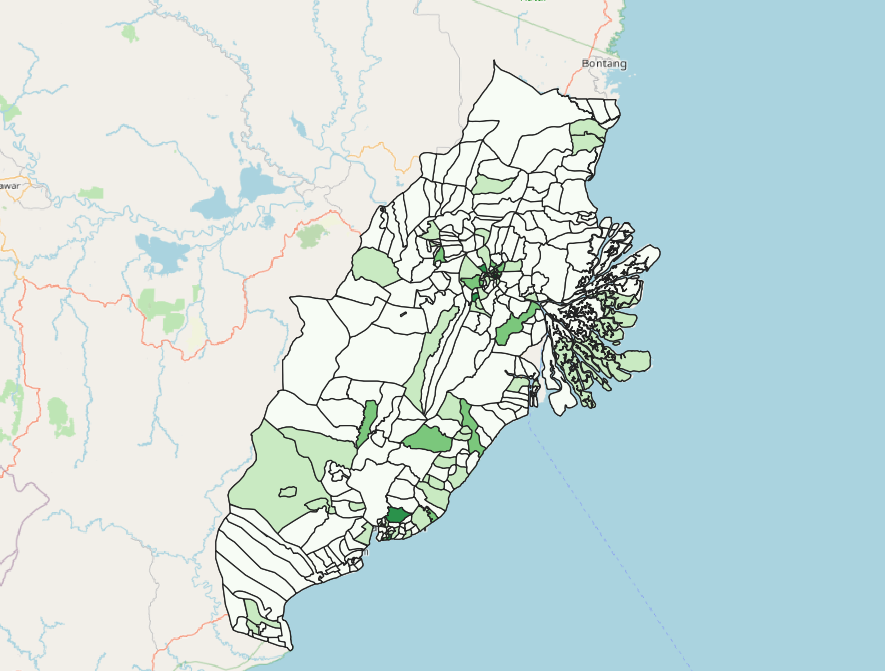

```{r setup, include=FALSE}
knitr::opts_chunk$set(echo = FALSE)
```

## 1. Objective: Creation of Appropriate Maps with these Data

* Population Density by District
  + Population of Adults
  + Population of Seniors
* Economic and Businesses
  + Agriculture
  + Mining
  + Commerce
* Transport and communication
  + Airports
  + Bus Terminals
  + Seaports
  + Roads
* Infrastructures
  + Buildings
  + Electricity
  + Water supply
* Environment and Hazard
  + Forests
  + Forest fire

## 2. Getting Started

>DIY: Using the steps you had learned from the previous section, add All_electricity, All_commerce, All_Watersupply, All_mining, map layer into the project.

Example of All_Electricity map layer

```{r}
knitr::include_graphics("img/ch1.png")
```

## 3.0 Symbolising Qualitative GIS Data Layers
In this section, you will learn how to symbolise GIS data layers by using their corresponding qualitative data values.

Using all_water_supply layer, right click on layer > properties. The Layer properties should pop up. 

Select on Symbology > Change size to 10, marker to SVG marker and select water & tap symbol.

You should see something like this:

```{r}
knitr::include_graphics("img/ch2.png")
```

Click on Apply and OK to close the window. You should see a screen similar to mine.

```{r}

```

This map is popularly known as Point symbol map among the GIS and cartography communities. Prior to GIS era, this kind of map took more than a month to prepare. With GIS, it only needs less than 15 minutes to prepare. The advantage of GIS-based point symbol map is that the map can be changed easily with very little effort. GIS-based point symbol map is also highly interactive. You can navigate around the digital map and zoom in to view the distribution in greater details.

>DIY: Using the steps you had learned repeat for Airports, Seaports, Bus Terminals and use appropriate SVG Symbols for them.

## 4.0 Choropleth map using GIS

Choropleth mapping involves the symbolisation of enumeration units, such as countries, provinces, states, counties or census units, using area patterns or graduated colors.

*   The major concerns of choropleth mapping are the method of data classification, areal symbolization, and the overall map design. General rules for choropleth mapping are as follows:

  + Use data that are assumed to be uniform throughout an enumeration unit.
  + Because enumeration units vary in size, do not map totals. Use derived values, such as ratios, rates, proportions, or percentages.
  + The best classing method depends on the data, the map reader and the purpose of the map.
  + When classifying data, the full range of data must be included and class values should not overlap. No more than six classes are recommended.
  + Class symbols (i.e. colors or patterns) must be easily distinguishable.

Using the All_electricity layer, we can see that it's in point format. When creating the choropleth map, we like to see if the overall distribution in the study area.

Navigate to Processing Toolbox > Count Points in Polygon

In Polygon, select Final_Shape (The shape used as basemap for our Study Area)

In Points, select All_Electricity (The points that you want to count)

```{r}
knitr::include_graphics("img/ch4.png")
```

Note that you should skip invalid geometry to ensure smooth process.

```{r}
knitr::include_graphics("img/ch4_1.png")
```

Once everything is in Order, click on Run. It is also a good habit to look through the Logs to ensure there are no errors in the process.

Once it has successfully run, you will notice that there are a temporary file name Count, and if you check the table attributes, you are able to see that each polygon has a new column appended to it called num_points. This is the number of points that fall within the polygon.

```{r}

```

Do remember to save the layer before proceeding as it is a temporary layer.

Once saved, click on layer > properties. The Layer properties should pop up. 

In the symbology table > change style to Graduated > Select desired colour ramp.

For Mode, select Natural Breaks (Jenks) and click classify. qGIS will automatically classify the values for you. 

```{r}
knitr::include_graphics("img/ch6.png")
```

Once done, click on APPLY and OK. You should see a screen similar to mine.

```{r}

```

>DIY: Using the steps you had learned repeat to create choropleth maps for Population Density by district, Commerce and ForestFire.
