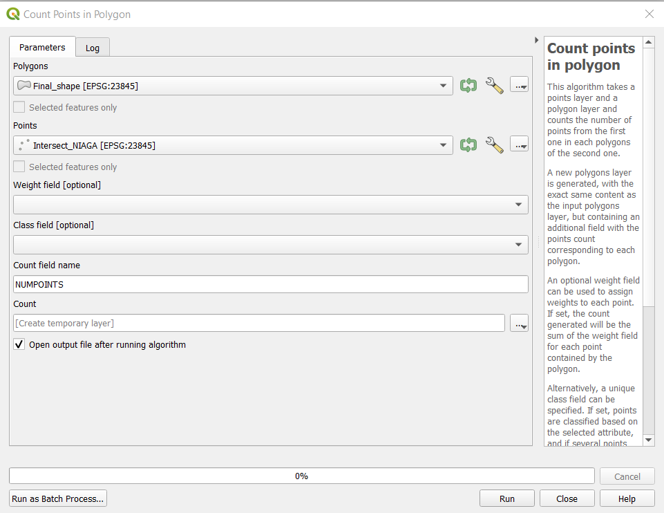

```{r setup, include=FALSE}
knitr::opts_chunk$set(echo = FALSE)
```

## 1. Objective: Creation of Appropriate Maps with these Data

* Population Density by District
  + Population of Adults
  + Population of Seniors
* Economic and Businesses
  + Agriculture
  + Mining
  + Commerce
* Transport and communication
  + Airports
  + Bus Terminals
  + Seaports
  + Roads
* Infrastructures
  + Buildings
  + Electricity
  + Water supply
* Environment and Hazard
  + Forests
  + Forest fire

## Creating Categorical Map

* Add All_commerce layer and forest fire into the project. These should have been merged earlier.

Example of map layer

```{r}

```

# 3. Creating Symbols and/or Area Colour

## 3a. For point data (symbols)

* We will need to use symbols to represent the various point layers in order for easier visualisation. 

* Using all_water_supply layer, right click on layer > properties. The Layer properties should pop up. 

* Select on Symbology > Click on Simple Marker > Change size to 10, marker to SVG marker and select water & tap symbol.


```{r}

```

If done correctly this should show:

```{r}
knitr::include_graphics("img/ch3.png")
```

## 3b. For area data (shaded area)

* We will use different colour to represent the different land type (e.g different types of forest)

* Using agriculture layer, right click on layer > properties. The Layer properties should pop up. 

* Select on Symbology > Click on Single Symbol and change to "Categorical" at the top.

* Select the appropriate category (e.g Legenda for the agricultural layer) and click on "Classify". The colouration should popup like this.


* We click on "Apply" and then ok to close the layer.

* If done correctly we should see something like this:


> If we are only creating a categorical map, other examples include generating maps for electricity, airport, seaport, bus terminal (all point data), and for forest and agriculture (all area data) For ROADS, follow ROAD DENSITY MAP preparation and for forest fire, follow FOREST FIRE preparation. For all other layers continue on forward.


## 3c. Creating the Choropleth Map

Choropleth map is used for some data like commerce (INTERSECT_NIAGA)

Using the INTERSECT_NIAGA (Commerce) layer, we can see that it's in point format. When creating the choropleth map, we like to see if the overall distribution in the study area.

* Navigate to Processing Toolbox > Count Points in Polygon

* Under Polygon, select Final_Shape (The shape used as basemap for our Study Area)

* Under Points, select All_Commerce (the points to be used as inputs into choropleth map)

```{r}

```

* If there is invalid geometry error, go to the Processing Toolbox on the bottom right hand corner of the page and type "Fix geometries". In the tool that comes up, select the "Fixed Geometry" tool and change the input layer to the Polygon (Final Shape) layer. If the data processing was done properly in the data preparation and cleaning stage, this should not occur.

```{r}

```

* Click on Run to start the process.

* A temporary file named Count will appear. Each value in the column NUM_POINTS is the number of points in the polygon.

```{r}
knitr::include_graphics("img/ch5.png")
```

* We save this layer as a laye in the GeoPackage file by right clicking on the layer, selecting "Save Feature As", and choosing the GeoPackage which we are using for the project. Ensure the correct CRS is set (EPSG:23845).

* Once saved, click on layer > properties. The Layer properties should pop up. 

* In the symbology table > change style to Graduated > Select desired colour ramp.

* For Mode, select Equal Count and click classify. This will classify based on percentile. 

```{r}

```

* Click on Apply in order for the classification to come up. Then close the window.

```{r}
knitr::include_graphics("img/ch7.png")
```

## 3d. Choropleth Map for Population Density

* This will be done using the study area layer. (FinalShape)

* We need to create several fields.

* First we have to right click > Open attribute table. In the layer that comes up, we need to add all the different population groups together. Therefore we have to create a new field.

* Right click on the layer > Open Attribute Table. In the window that opens, select “Create Calculated Field”.

{width=80%}

* In the window that opens, make sure ‘Create a New Field’ is selected. Enter “POPULATION” into the field name and sum up all the population layers "U5", "U10" etc. The code should be something like "U5" + "U10" + "U15" ... etc, taking into account that one column equals to the number of people in that column.

* When this is done, we need to calculate the area of each district.

* We repeat the step before but instead of "POPULATION", type "AREA". In the field window, type "AREA". Then click Run to create the calculated field.

{width=80%}

* Following that, we create a new field called "DENSITY". Repeat the following step but in the field window type "POPULATION" / "AREA", this will divide the population by area to get density.

* If all is done this should come up:

{width=80%}

* Now, we can follow the steps in the previous section to generate the choropleth map, starting from section 4. Ensure that for the columns to be chosen to generate the choropleth map, it is set to "DENSITY" and not any other column.

* When it is complete, the map should look like this:

{width=80%}


