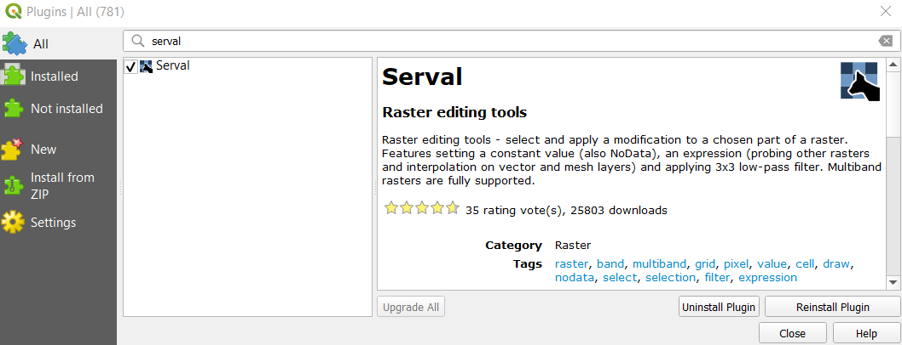

```{r setup, include=FALSE}
knitr::opts_chunk$set(echo = FALSE)
```

## 1. Selection of Required Data

* The datasets that are being used for the project include:
  + Topographical data from here: https://www.indonesia-geospasial.com/2020/01/shp-rbi-provinsi-kalimantan-timur.html. Data of Kota Balikpapan, Kota Samarinda, Penajam Paser Utara and Kutai Kartanegara are to be downloaded.
  + The https://www.indonesia-geospasial.com/2020/04/download-shapefile-shp-batas-desa.html comprises the population and demographic data. Data for Kalimantan Timur province was downloaded.
  + https://www.indonesia-geospasial.com/2020/01/download-dem-srtm-30-meter-se-indonesia.html The digital elevation model at 30m     resolution
  + https://www.indonesia-geospasial.com/2020/03/download-data-shapefile-shp-geologi-se.html The geological data.
  + https://www.indonesia-geospasial.com/2020/04/shapefile-shp-titik-api-hotspot.html The forest hot spots.
  + https://download.geofabrik.de/asia/indonesia.html Indonesia OSM Data. Data was downloaded for Indonesia as a whole, and only the road layer was kept.
  + https://www.indonesia-geospasial.com/2020/09/download-shp-tutupan-lahan-tahun-2019.html Tuplah data set for agricultural and non-agricultural land use.

* After downloading and opening the data, we had to examine individual layers and see what is to be kept.
  + The topographical data layer:
    + Airports: AIRPORTS_LN_50K and AIRPORTS_PT_50k
    + Toponimi (Miscellaneous items): TOPONIMI_PT_50k
    + Roads: OSM Layer
    + Settlements: PEMUKIMAN_AR_50k
    + Bus Terminals: TERMINALBUS_PT_50k 
    + Mining Areas: TAMBANG_AR_50k
    + NB: The topographical dataset .zip files comprises these layers for every regency/area (i.e one each for Kutai Kartanegara, one         for Kota Balikpapan etc etc, with the same names) 
    
  + The demographic layer for Kalimantan Timur:
    + Just 1 layer which is kept (BATAS_DESA_DESEMBER_2019_DUKCAPIL_KALIMANTAN_TIMUR.shp)
    
  + The Tuplah data set:
    + Different forms of agriculture: Tuplah_Kalimantan_Timur_2019.shp
    + Different forms of forestry: Tuplah_Kalimantan_Timur_2019.shp
  
  + The digital elevation model for calulating slope and elevation:
    + DEM SRTM 30M KALIMANTAN TIMUR.tif
  
* For the topographical map layer, we would have to merge the datasets showing different natural/artificial features to supplement, and clip the layers to within the study area.
  + For each of those layers, we would combine the layers that show the same attribute.
  
* The study area to be used is derived from the population and demographic layer. 

* Import the shapefile into Qgis by double clicking on it. (BATAS_DESA_DESEMBER_2019_DUKCAPIL_KALIMANTAN_TIMUR.shp)
  
* We need to select the suitable study area since the layer would contain the regencies, districts and sub-districts for the entire province of East Kalimantan. Right click on the layer, open Attribute Table and first we filter by the "KAB_KOTA" column. Open the "Select Fetures using an Expression" field and enter the following: "KAB_KOTA" = 'KUTAI KARTANEGARA' or "KAB_KOTA" = 'KOTA BALIKPAPAN' or "KAB_KOTA" = 'PENAJAM PASER UTARA' or "KAB_KOTA" = 'KOTA SAMARINDA'.

{width=100%}

* In the resultant selected layers, we toggle editing on the layer and then copy the selected areas and paste it as a temporary layer by going to Edit > Paste Features As > Temporary Scratch Layer.

* Repeat the steps above, but with the filtering by the specific districts as mentioned in the project brief: 

  + All sub-districts and district of Kota Balipapan, Kota Samarinda
  + Kutai Kartanegara: Anggana, Loa Janan, Loa Kulu, Marang Kayu, Muara Jawa, Samboja, Sanga Sanga, Sebulu Tenaggarong, Tenggarong Seberang and Muara Badak.
  + North Penajam Paser (Penajam Paser Utara) Regency: Babulu, Penajam, Sepaku and Waru.

* This time we have to filter on the column 'KECAMATAN' instead.

* We can manually select the districts and sub-districts by sorting by the "KECAMATAN" column. We select all the districts and sub-districts that do NOT fall into the ones listed above, and then invert the selection using the invert selection tool.

* Following that, we save the selection into a new temporary layer using the steps above (Edit > Paste Features As > Temporary Scractch Layer)

Before proceeding there are some geometrical errors which we have to be fixed.

* To fix this, go to the **Processing > Toolbox** on the right and search for Fixed Geometries.
  
{width=60%}

* Select the newly imported layer and press "OK" in the resultant window.
    
{width=100%}
  
* Save the resultant layer in a GeoPackage format. Click on the newly created temporary layer, go to Export > Save Features As. In the resultant window, select the format **GeoPackage** and then create a new GeoPAckage file. Name the layer "FinalShape", leave all other features as intended, before saving. Make sure projection is **EPSG:23845 (DGN / Indonesia TM-3 zone 54.1)**.


{width=60%}

## Clipping Layers into Study Area

The processing of each layer will differ according to their data type. We have sorted the layers that have been used into the following categories:

**Points**

+ TOPONIMI_PT_50k
+ TERMINALBUS_PT_50k
+ Forest Fire (Titik Api Hotspot se-Indonesia Tahun 2019)
+ Commerce (NIAGA_PT_50k)
+ Electricity and Network: 
  + GENLISTRIK: Electricity, 
  + KABELLISTRIK: Power cable, 
  + MENARALISTRIK: Electric Tower, 
  + MENARATELPON: Tower Phone, 
  + PANCARTV: TV Transmitter, 
  + PANCARRADIO: Radio Transmitter
  + Water Supply (Distributors)

**Area**

+ Mining Areas (TAMBANG_AR_50k)
+ Non-Agricultural Forest Areas (Tuplah_Kalimantan_Timur_2019.shp)
+ Agricultural Areas (Tuplah_Kalimantan_Timur_2019.shp)
+ Settlements (PEMUKIMAN_AR_50k)

**Mixed**

+ Airport (Both point and area)
  + AIRPORTS_LN_50K and AIRPORTS_PT_50k 

**Lines**

+ Roads (gis_osm_roads_free_1.shp)

**Raster**

+ Digital Elevation Model (EM SRTM 30M KALIMANTAN TIMUR.tif)

### Processing Polyline (Road Layer)

* Import the layer (gis_osm_roads_free_1.shp).

* There is a need to join incomplete roads. Examine each road segment closely and find out which road segments can be joined, for example roads which go above the bridge. 

  + This will result in the intersection points being overstated when conducting site survey analysis. While it may not be possible to fix every road, most roads where this issue presents itself, are located along the coast or over bridges.
  
* We need to clip the road to the study area. Go to Vector > Geoprocessing Tools > Clip, make sure the newly imported road layer is input as the Input Layer, and the layer to be used as a clip is the FinalShape layer (Overlay Layer)that had been prepared.

{width=40%}

* Save the temporary layer as a GeoPackage layer with the correct CRS as **EPSG:23845 (DGN / Indonesia TM-3 zone 54.1)** and make sure under the "Geometry" tab, the data type is changed to "Line" and the "Include Z values" is not checked.

* Following that, toggle editing on the layer by clicking on the pencil icon. Make sure the selection method is "Select Features" and not other selection methods.

* Select the 2 road segments that are supposed to be joined together.


* Click on "Merge Selected Features" in order to merge the 2 line segments together to form a single feature, which we can then extend in order to touch the 2 edges of the line.

{width=40%}

* Post-merge we have to re-select the merged segment which has become a single feature by clicking on the line segment. Following that we click on the "Reshape Feature".

{width=40%}

* We click on the edge of one line and then drag it to the start of the other line, this will join the 2 line segments together to form a complete road.

 

* Repeat this for all segments that have been found to have missing road segments.

{width=40%}
  
  + Remove all the previous temporary layers created by right clicking on them and selecting "Delete Selected Layer".
  
  + Save the newly created road layer by right clicking on it in the menu and selecting Save Features As, and in the resultant box that comes up, ensure that the GeoPackage file that the base map layer was selected, is selected under the file name and the layer name is set to "Roads", and the map CRS is set to EPSG:23845.

### Processing Area (Polygon) Data - Topographical Data

* The area data needs to be merged into a single layer for analysis.

  + We first open up the characteristic of concern, for example, urban settlements layer. 
  


* Following that, we need to clip the layers so that they only overlap our area of study. Go to Vector > Geoprocessing Tools > Clip, make sure the newly imported road layer is input as the Input Layer, and the layer to be used as a clip is the FinalShape layer (Overlay Layer) that had been prepared. Repeat this for each layer.

NB: If the geometries are invalid it is required to use the "Fix Geometries" tool from the Processing > Toolbox (CTRL+ALT+T) before moving forward with the analysis.

{width=40%}

* The completed, clipped layers should look like this: 


* The different areas then need to be combined together. Go to the Processing toolbox on the bottom right hand corner of the page and select "Merge vector layers". 

* In the resulting window, select the desired layers to be merged, for example:
  


* We keep the CRS as it is; we will change the CRS when we export as a GeoPackage.
  
* After merging, the layers should appear as this:
  


* The layers can now be saved as a GeoPackage. Click on the newly merged layer, go to Export > SavE Features As > and name the layer a good name (for example, Pemukiman Vector). Make sure GeoPAckage is selected as the format, and the chosen GeoPackage is the one in which the base layers are saved in.
  
* Change the "Geometry Type" to 'Polygon" and uncheck the "Include Z-dimension". 


* Repeat this step for all other applicable layers that are in the "Polygon" format.

### Processing Area Data - Tuplah

* For Tuplah, we only need to filter the data that is to be selected.

* We might need to fix the geometries, by using the "Fix Geometries" tool explained int he Polyline section.

* We right click on the layer and select > Open Attribute Table. In the table that appears, click on "select by Expression" and run the following command:

  + For the agricultural layer: "Legenda" =  'Hutan Tanaman' or  "Legenda" =  'Pertanian Lahan Kering' or  "Legenda" =  'Pertanian Lahan Kering Campur' or  "Legenda" =  'Sawah'
  + For the forest layer: "Legenda" =  'Hutan Lahan Kering Primer'  or  "Legenda" =  'Hutan Lahan Kering Sekunder' or "Legenda" =  'Hutan Mangrove Primer' or "Legenda" = 'Hutan Mangrove Sekunder' or "Legenda"= 'Hutan Rawa Sekunder'or "Legenda"= 'belukar’ or "Legenda"= 'belukar rawa’

* Following that, we right click and save selected layer as a GeoPackage. Make sure the projection is changed to **EPSG:23845 (DGN / Indonesia TM-3 zone 54.1)**.

* Repeat the same step for the agricultural layer.

### Processing Point Data

* The point data needs to be merged into a single layer for analysis.
  
* We first open up the characteristic of concern, for example, toponimi layer (TOPONIMI_PT_50k).
  
* In some layers, we are only interested in certain attributes. For example, for the Toponimi Layer, we are interested in the "Kantor Banks". Therefore, some filters need to be applied.
    
  + We right click on the layer > Open Attribute Table. 
    
  + We toggle the editing by clicking the pencil icon near the top of the window. 
    
  + Following that, we sort the table by "Remark" by clicking on it, and then selecting all the rows with attribute Remark = "Kantor Bank". 
  
    {width=80%}
    
* We then close the attribute table, and toggle editing on the Toponimi layer (or any other point layer of concern). Following that, we copy the selection, and paste it in a new scratch layer by going to Edit > Paste > Temporary Scratch Layer. It would be good practice to rename the temporary scratch layer for later (for e.g, KK Kantor Bank, PPU Kantor Bank etc)
    
* We repeat all steps up till this one, for the same data of interest, for other regencies / cities.
    
* Repeat the steps above for the line data, in order to merge the layers:

* First, we select the layers that describe our attribute in question. Go to the Processing Toolbox and search for "Merge Vector Layers", and select the layers which we have just added. For example, if we were working on the toponimi layer we would add in the temporary layers created previously e.g KK Kantor Bank, PPU Kantor Bank, KS Kantor Bank. We leave the CRS as is, and then run the algorithm.
  
  

* Before saving the layer we need to take care of duplicate points since they might be represented multiple times. Go to the Processing Toolbox and search for "Delete Duplicate Geometries" When the window opens, we use the layer that we had just created in the previous step as the Input layer, and then run.
  


* After running, the duplicate geometries (For example, one bank at the same location might be represented by multiple points in different layers) should be removed. We can then save this layer in our GeoPackage file. Right click on the processed layer, select "Save Features As", and make sure GeoPackage is selected in the window that comes up. Navigate to the GeoPackage that contains the base layer, and name our layer "AllBanks_Vector", or for whatever attribute of interest that is being explored. Make sure the CRS is set to EPSG:23845 and the "Point" datatype is set in Geometry, as well as the "Include Z dimension" is unchecked, then save the newly formed layer.


### Processing Point and Polygonal Data

This section should only be applicable to the airport layer, because the point data for airports comprise an additional airport that is not presented in the area data. It is important, because this missing airport is the new international airport for Samarinda and can absolutely not be eliminated from the study.

* The general approach is to create a new polygon where the data is needed.

* Import the airport polygon and point layers. And view them. We see that there's a point that doesn't have a corresponding polygon, and a polygon inside Samarinda that is the decomissioned airport which has to be deleted.


* For the point layer that we need to add a polygon to, we first toggle the editing by clicking on the pencil icon on the top bar.

{width=40%}

* Following that we click on the "Add Polygon" next to it and draw it around the OSM layer boundary of the airport. To complete the shape we right click; to add a corner of the polygon we left click.

{width=40%}

* Once the shape is created an additional window will come out to enter the attributes. To know the attributes to add, we have to open the point layer attributes, so we toggle the Information tool and click on the point layer. A window will pop up with the attributes. We transfer the data in the NAMOBJ and REMARK column to the attributes of our newly created polygon. Then we click "OK".


* To remove the decommissioned airport, we click on the Select tool, move down to its location, select the airport and press the Delete key on the keyboard. 


* After these 2 modifications are complete we then toggle editing off by clicking on the pncil button again then accepting the changes that are made.

* Following that, we follow the rest of the procedures in the Area Dataset processing in order to merge the vector layers together and then export them.

### Processing Raster (DEM) Layer

There are some erroneous values neaar the wetlands that have to be resolved and this is a rudimentary way of doing ig.

Click on plugin > search “Serval”.

```{r}

```

Click Install, we should be able to see it downloaded similar to the screenshot below.


```{r}
knitr::include_graphics("img/download1.png")
```


Under the Layer tab > select Add Layer > Raster Layer. The data source manager window will pop up.
From source: select under the Provinsi Kalimantan Timur folder, import DEM SRTM 30M KALIMANTAN TIMUR.tif into the Qgis project.

{width=40%}


Using previous steps, save the layer into geopackage format and rename the file as DEM, change CRS to project CRS, then click on save.

We will need to reproject it to 100x100m in order for our further analysis. Go to the Processing Tools on the right hand side and click on Reproject (Warp).

{width=40%}

In the window that comes up, make sure that the window settings are set as follows: (The output file resolution in target georeferenced units should be 100)

{width=80%}

We the run the command then we will get a reprojected layer. Again we save that layer into the GeoPackage format and we will use this for further analysis.


```{r}
knitr::include_graphics("img/pr3.png")
```

Next we will use Serval to select the DEM layer and change the values 
Zooming into the Mangrove layers, there are several anomalies where the pixel value is over 1000. It is not possible for the height level to be above 1000 in that area and not with such a steep gradient.

{width=80%}

We go to serval's select by polygon tool and draw a polygon around it. Then, on the top bar we enter a low value (e.g 10). 


```{r}
knitr::include_graphics("img/pr4.png")
```

{width=80%}

When this is done, we then click on the "Apply Value to Selection" 2 buttons to the right of the number we just input. Then, the value should be changed to 10 for the entire selection.

The layer is now ready for future processing.


    

