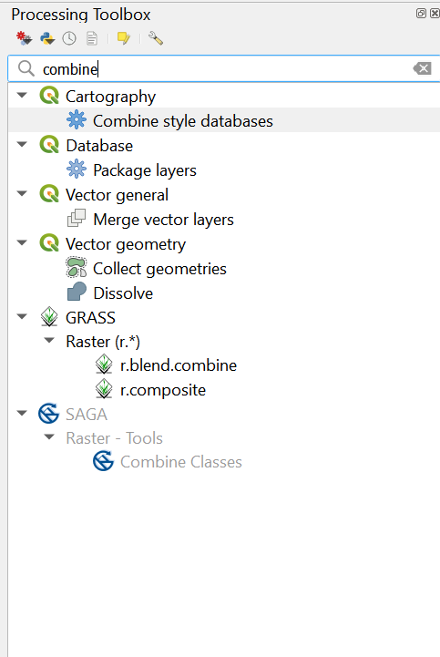
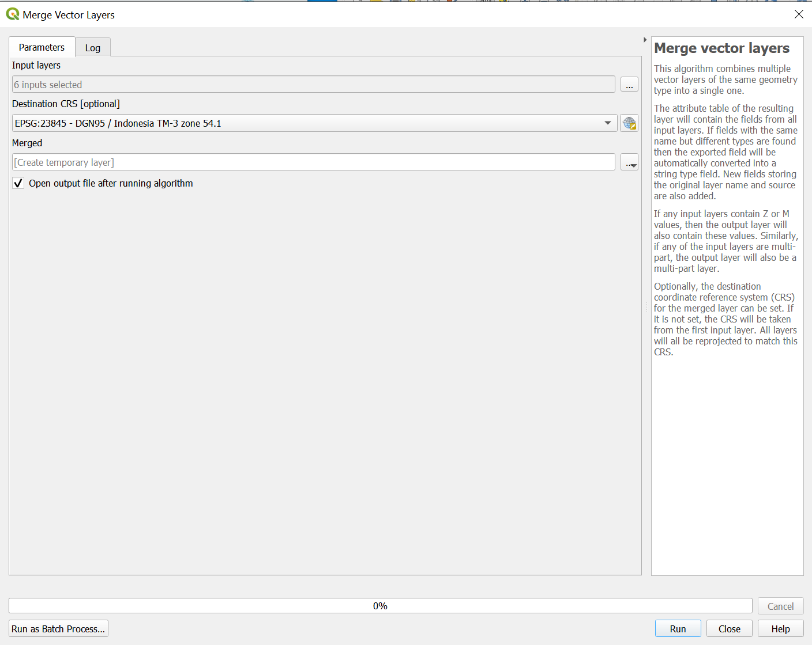
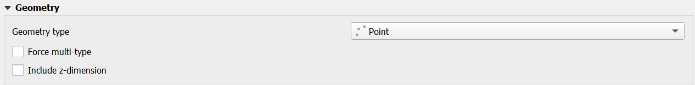
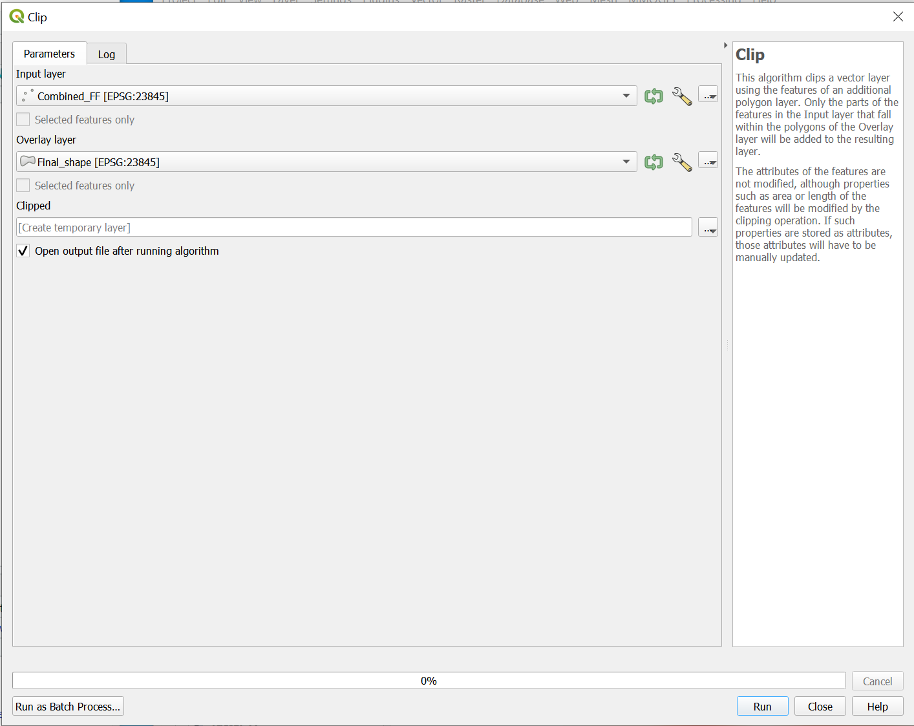
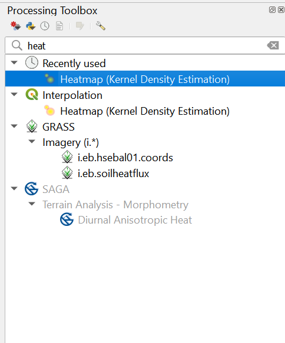
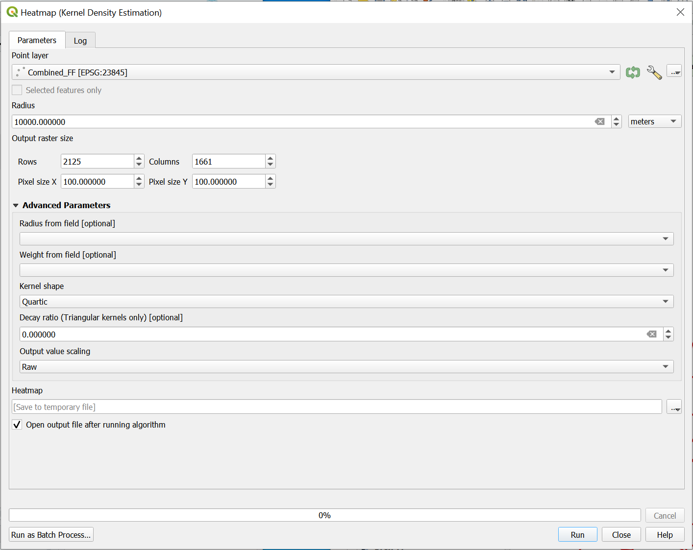
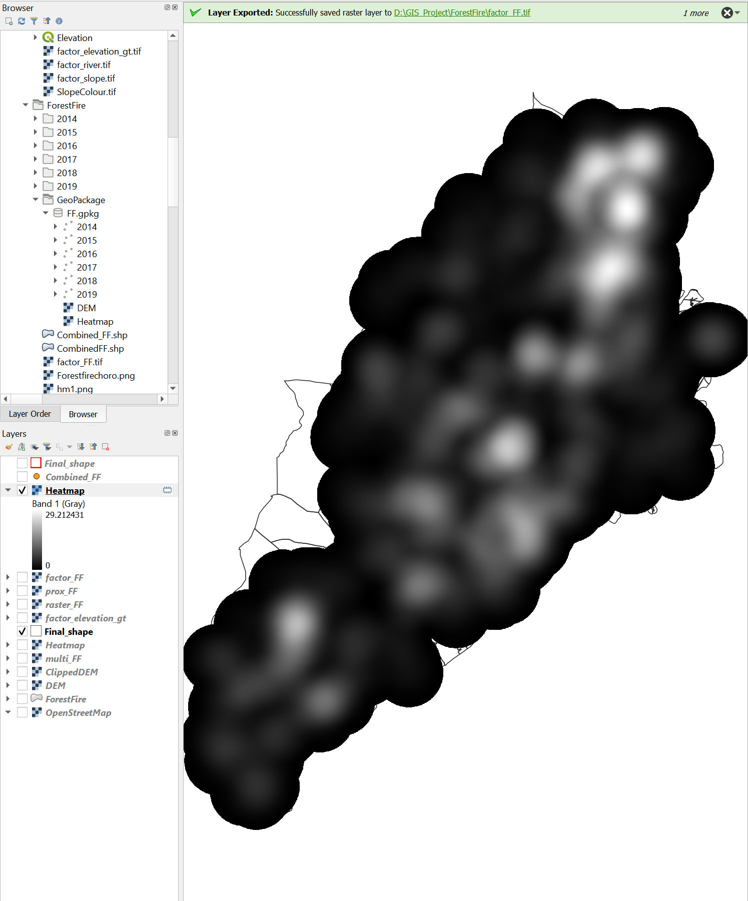
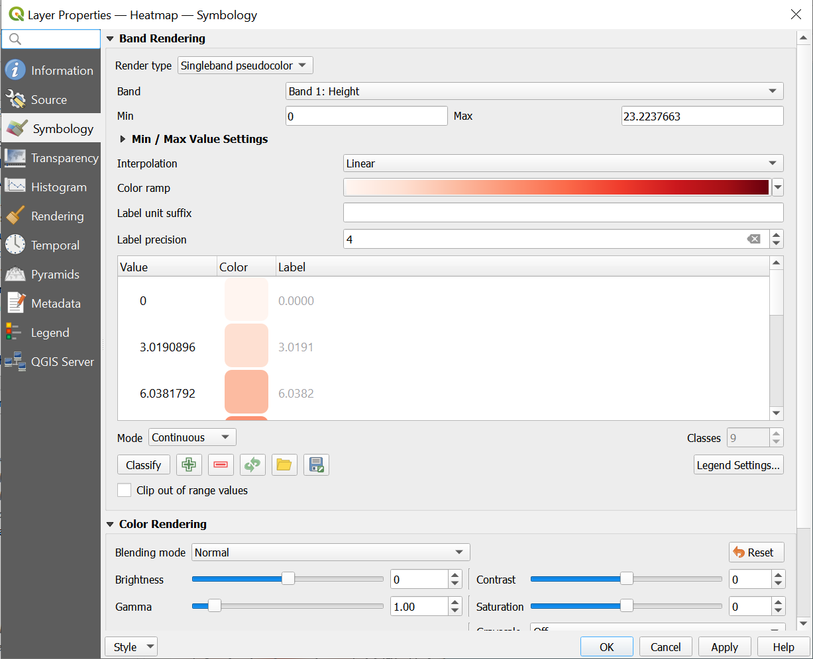
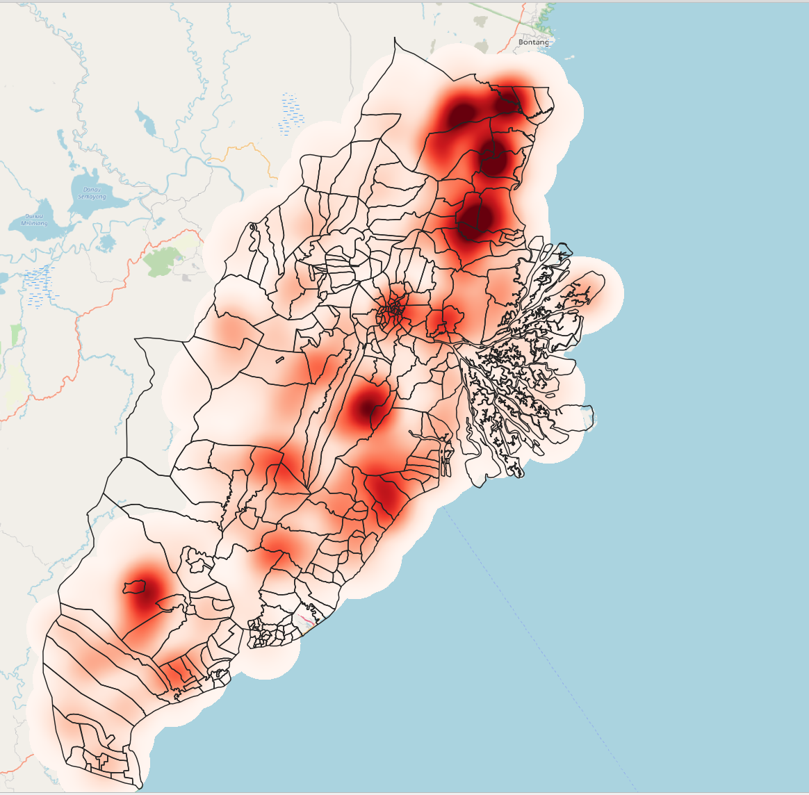

```{r setup, include=FALSE}
knitr::opts_chunk$set(echo = FALSE)
```

## 1. Selection of Required Data

To create the heatmaps, we will be using the forest fire dataset and the final_shape shapefile.

  + https://www.indonesia-geospasial.com/2020/04/shapefile-shp-titik-api-hotspot.html The forest hot spots.
  
The forest fire hot spot are split into 6 files of each year from 2014 - 2019. We will want to merge these layers into one shapefile that contains all the hotspot from eyar 2014 - 2019.


## 2. Steps to create merged forest fire shapefile

1. Put in all the forest fire layers (2014 - 2019) into QGIS.


2. Look for the merge layers function by searching for 'combine'.Open up the merge vector layers function. 

```{r}

```


3. For the input layers, put in FF_2014 to FF_2019.For Destination CRS, put in EPSG : 23845 DGN95 / Indonesia TM-3 zone 54.1 and then click on Run.

```{r}

```


4. A new temporary layer would appear called ‘Merged’


5. Export ‘Merged’ into a shapefile called CombinedFF and ensure the CRS is the same as step 3. Change geometry type to Point and uncheck the box where it says include z-dimensions.

```{r}

```

6. To get forest fire hotspots that are only in the study area. We first bring in the study area shapefile into QGIS.


7. Then we use the Clip function. For the Input layer, we put in CombinedFF and the overlay layer as the shapefile for the study area (Final_shape). Then we click on run

```{r}

```

8. A temporary layer would appear called Clipped. This will be our final shapefile/layer that we want


9. Export that into a shapefile and call it Combined_FF. Ensure the CRS is the same as Step 3. This will be our final combined forest fire layer.


## 3. Creating the heatmap

1. Moving on to creating the heatmap for our forest fire layer. We first search 'heatmap'in the Processing Toolbox. Then click on Heatmap(Kernel Density Estimation).

```{r}

```

2. For the point layer, put in 'Combined_FF' and for the Radius put in 10,000. For Pixel size Y and X put in 100 for both of them. Your final screen should look like this. 

```{r}

```

3. Click Run. You should get a temporary layer called Heatmap as shown below.

```{r}

```

4. Export the Heatmap as a Geopackage and ensure that the CRS is EPSG : 23845 DGN95 / Indonesia TM-3 zone 54.1. 

5. Next, we will be changing the symbology of the layer. Click on Properties of the new Heatmap layer and then Symbology. 

6. Change the render type to 'singleband pseudocolour' and the colour ramp to 'Red'. Once you are done, your screen should look like this.

```{r}

```

7. Click on Apply and Ok. Your screen should look like this

```{r}

```

>DIY: Using the steps you had learned from the previous section, add All_electricity, map layer into the project.