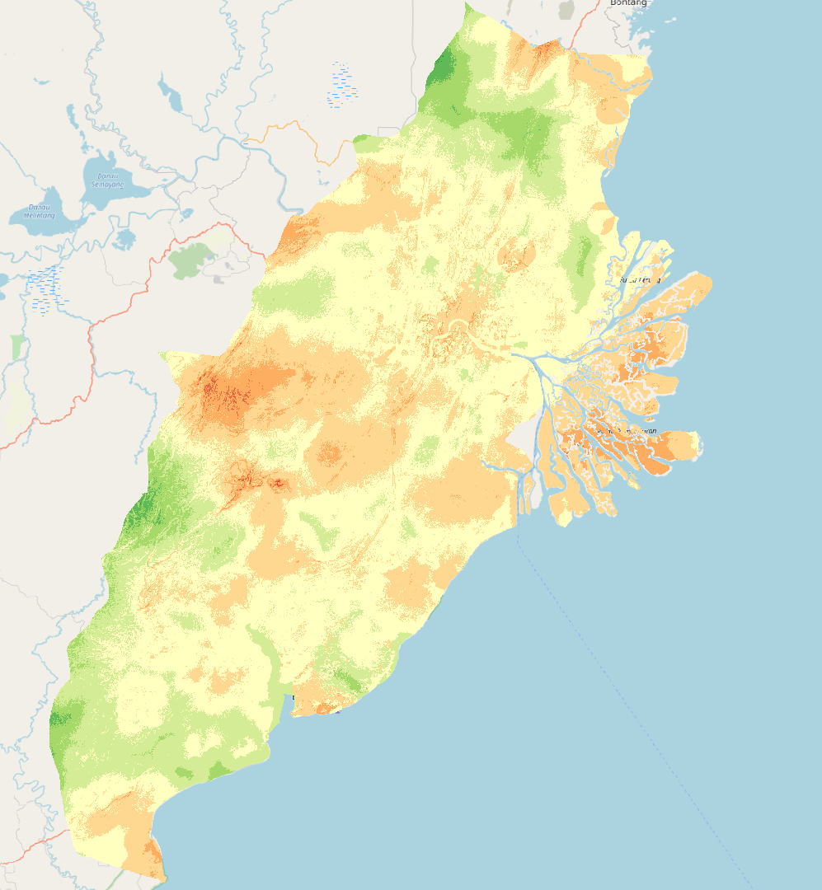

```{r setup, include=FALSE}
knitr::opts_chunk$set(echo = FALSE)
```

## 1. Objective: 


## 2. Getting Started

First, open toolbox and type in 'Raster Calculator' and open it 

In the Expression box, key in (factor layer)  * (assigned weights) for all the individual factors (slope, river, road, forest fire, forest area, urban settlement, airport, seaport)

```{r}
knitr::include_graphics("img/AHP1.png")
```

* Please use the values here:
+ 0.199 * "factor_slope@1"
+ \+ 0.190 * "factor_river@1"
+ \+ 0.134 * "factor_FF@1"
+ \+ 0.130 * "factor_road@1"
+ \+ 0.145 * "factor_forest@1"
+ \+ 0.105 * "factor_ub@1"
+ \+ 0.063 * "factor_airport@1"
+ \+ 0.04 * "factor_seaport@1"

For the Reference layer, tick the box for the DEM layer and click OK.

Click on Run. There would be a new temporary layer called 'Output'. Save it as a geopackage and name it 'AHP'

Open the toolbox again and type in 'Reclassify by table'. Click into it 

In the reclassification table, click on the three dots and it would bring you into a new page.

* Click on 'Add row' ten times.
+ For the first row, put in 0.1 as the max and 1 as the value.
+ For the next row, put in min as 0.1, max as 0.2 and value as 1. Do this for the rest of the rows

```{r}

```

Once you are done. Click on OK to be returned into the previous page. Click on Run

Notice that a new temporary layer would be created called Reclassification table.

Save the temporary layer as a geopackage and name it AHP_reclass

Now, go into properties of AHP_reclass and into Symbology.

Change the render type to singlenband pseudocolour. Since the range of the AHP_reclass layer only goes from 3 to 8, we will only need to have 6 classes

Once you have 6 classes, change the value of these 6 classes from 3 to 8.

Click on the colour ramp and change it to spectral. Your window should look like this

```{r}

```

Click on Apply and OK. Your new layer would look like this 

```{r}

```