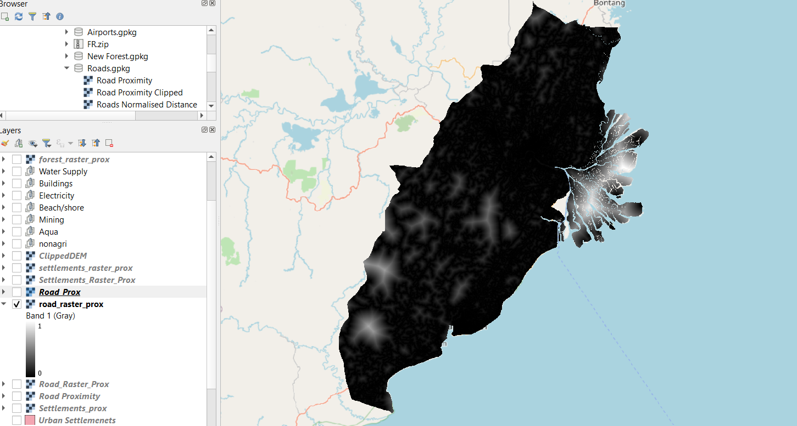

```{r setup, include=FALSE}
knitr::opts_chunk$set(echo = FALSE)
```

## 1. Objective: 

The objective of this section is to use the raster layers from the data preparation section to create proximity maps (distance) as well as to normalise the values of the proximity map in order to accurate derive selection criteria analysis from it.

## 2. Getting Started

### 2.1 Clipping DEM to Study Area

We will need to clip the raster layers to the study area.

From processing toolbox select under Raster > Clip as Mask Layer. Input DEM inside and polygon select Final_shape. 
To ensure the no data values show up correctly, assign '99999999' to  "specific nodata value to output bands". We should see something similar to this.

```{r}

```

This is to clip the DEM so that it will be aligned to the final_shape of our Study Area.

Repeat for the other raster layers.

>Following instructions stated in other parts of the guide we have to save the new raster layers as layers in the GeoPackage. Ensure that ALL height and width of raster grids are set to 100 exactly.

```{r}
knitr::include_graphics("img/pr6.png")
```

## 3. Creating the Proximity Map

* Now, the Proximity operation of QGIS will be used to compute the proximity to roads layer.
For the menu bar, select Raster -> Analysis -> Proximity (Raster Distance). In the window that appears, enter the following:

  + Input layer, select raster_roads from the drop-down list.
  + For Distance units, select Georeferenced coordinates from the drop-down list.
  + For Output data type, select Float32 from the drop-down list.
  
After running, the output should be similar to this:

```{r}
knitr::include_graphics("img/pr9.png")
```

Now we can move on to normalization of the map layer.

## 4. Clipping the Proximity Map 

* At the Search pane of Geoprocessing Toolbox panel, type 'Clip Raster by Mask Layer'. Double-click on Clip Raster by Mask Layer. The dialog window of Clip Raster by Mask Layer appears.

For the input layer of the Clip Raster by Mask Layer window, put in prox_road. For the mask layer, put in FinalShape.

For the Source CRS and Target CRS, ensure that both of them are EPSG : 23845 DGN95 / Indonesia TM-3 zone 54.1. 

For the section 'Assign a specific nodata value to output bands [optional]', change it to 99999999. We should see this:

```{r}

```

When we are done, click on 'Run'. A new layer called Clipped by Mask Layer would appear. Save it as a geopackage and call it clippedprox_road, keeping in mind the project CRS.


## 5 Using Raster Calculator

* At the Search pane of Processing Toolbox panel on the right hand side of the window, type 'raster calculator'. Double-click on Raster calculator of Raster analysis. The dialog window of Raster Calculator appears.

+ At the Layers panel of Raster Calculator dialog window, double-click on clippedprox_road, it will appear in the expression. Select the divide key “/” and input the maximum value of the layer you are using. In this case for roads is “13263.8613281250”. We can find out the maximum and minimum value by going to right click on the proximity map layer > Properties and scroll down to bands.

+ We add in reference layer  (FinalShape) as well as change CRS type into Project CRS. 

```{r}

```

+ After this is done, save the clipped layer as a GeoPackage layer. Give it an appropriate name like "factor_road".

+ The output should be somewhat similar to below:

```{r}

```

We then have to repeat these steps for:

+ settlements
+ forest
+ airport (make sure the buffer layer is being selected)
+ seaport
+ forest_fire
+ rivers
+ Slope. Note: Special Case for normalising the "Slope" layer. There is no need to find the proximity map. Simply go straight to the Raster Calculator and enter the maximum and minimum values of the slope raster layer by going to proximity map layer > Properties and scroll down to bands.

## 6. Changing of Certain Raster Values

For the airport and forest fire layers we need to make sure that the locations themselves have a value of 0. It is only values that are right outside them that take on a value of 1, because it is not logical to build over the airport or settlements as a recommendation.

* We use the Serval tool again. This time we use "Select Raster based on Layer" tool. In the window that opens, select either the Urban Settlements or the Airport Buffer vector layer and then run the command. The raster should be selected in the shape of those two layers.

  {width=30%}
  
* Following that we  go to the top bar we enter a 0 to indicate non suitability.

{width=80%}

When this is done, we then click on the "Apply Value to Selection" 2 buttons to the right of the number we just input. Then, the value should be changed to 0 for the entire selection.

{width=80%}

The layer is now ready for future processing.

