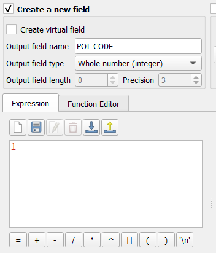

```{r setup, include=FALSE}
knitr::opts_chunk$set(echo = FALSE)
```

## 1. Objective: 


## 2. Getting Started

You will learn how to create raster and proximity map layers.before that, we will be installing a plugin called serval. Serval is a Raster editing tools, you can select and apply a modification to a chosen part of a raster.

Click on plugin > search “Serval”.

```{r}
knitr::include_graphics("img/pr1.png")
```

Click Install, you should be able to see it downloaded similar to the screenshot below.


```{r}

```

## 2.1 Importing raster GIS data layer
Under the Layer tab > select Add Layer > Raster Layer. The data source manager window will pop up.
From source: select under the Provinsi Kalimantan Timur folder, import DEM SRTM 30M KALIMANTAN TIMUR.tif into the qGIS project.

Your screen should look similar to the figure below.

```{r}

```

Using previous steps, save the layer into geopackage format and rename the file as DEM, change CRS to project CRS, change the layer resolution to 100width and 100 height. Once ready, click on save.

```{r}

```

Next we will use Serval to select the DEM layer and change the values 

```{r}

```

## 2.2 Working with SAGA clip raster with polygon

From processing toolbox under SAGA, select clip raster with polygon. Input DEM inside and polygon select Final_shape.

```{r}

```

This is to clip the DEM so that it will be aligned to the final_shape of our Study Area.

>DIY: Once done, save the DEM layer as Geopackage and rename it as ClippedDEM

Your screen should look similar to the screenshot below.

```{r}

```

## 3.0 Computing proximity to layers
After creating DEM layers, we will now learn how to use raster GIS operation to derive analytical layers from the original geographic layers.

Using QGIS' Closeness (Raster Distance) function, generate a proximity to roads layer. However, we must first rasterise the roads layer before proceeding with the computation. This is because the Proximity (Raster Distance) function requires a raster input GIS layer.

### 3.1 Creating attribute field for rasterising
Before we can rasterise the roads layer, we need to add a control attribute field in the roads layer.

At the Layers panel, right-click on Roads layer > Open Attribute Table. The attribute table of roads layer will appear.

From the menu bar of roads layer attribute table, click on Open field calculator icon.The Field Calculator dialog window appears.

Keep Create a new field option checks.
For Output field name, type POI_CODE.
At the Expression pane, type 1.
Your screen should look similar to the figure below.

```{r}

```
Click on OK button to run the function.

You will notice that a new field called POI_CODE has been added into the attribute table of roads GIS layer. Also note that all the records are indicated with POI_CODE values equals to 1. Save the editing.
Now we are now ready to rasterize the roads layer.

## 4.0 Rasterizing road layer
* From the menu bar, select Raster -> Conversion -> Rasterise (Vector to Raster).The Raster (Vector to Raster) dialog window appears.

+ For Input layer, select Roads from the drop-down list.
+ For Field to use for a burn-in value, select POI_CODE from the drop-down list.
+ For Output raster size units, select Georeferenced units.
+ Keep both horizontal and vertical resolutions at 100 (meaning 100m by 100m resolution).
+ For Output extent, click on Calculate from Layer.
+ Select DEM from the drop-down list.

When you are ready, click on Run button.

When the operation ended, the dialog window will display the operation log. Make it a good practice to read the output display to ensure that the process has completed without any error. After confirming that there is no error. You can close the dialog window.

You should see a screen similar to this:

```{r}

```
 
>DIY: Using the steps you have learned in previous section, save the temporary layer into GeoPackage format. Call the newly exported layer raster_roads. Next, remove the temporary layer from QGIS.


## 4.1 Working with Proximity function of QGIS

* Now, the Proximity operation of QGIS will be used to compute the proximity to roads layer.
For the menu bar, select Raster -> Analysis <- Proximity (Raster Distance). The Proximity (Raster Distance) dialog window appears.

+ For Input layer, select raster_roads from the drop-down list.
+ For Distance units, select Georeferenced coordinates from the drop-down list.
+ For Output data type, select Float32 from the drop-down list.
+ Click on Run button.

>DIY: Using the steps you had learned, Clip the proximity map to Final_shape and save the newly computed proximity map into GeoPackage format with a resolution of 100m x 100m. Call the layer Road_Prox.

Your screen should look similar to the screenshot below.

```{r}

```

Now we can move on to normalization of the map layer.

## 4.2 Working with Proximity function of QGIS

* At the Search pane of Geoprocessing Toolbox panel, type raster calculator. Double-click on Raster calculator of Raster analysis. The dialog window of Raster Calculator appears.

+ At the Layers panel of Raster Calculator dialog window, double-click on Road_Prox, it will appear in the expression. Select the divide key “/” and input the maximum value of the layer you are using. In this case for roads is “13263.8613281250”
+ Remember to add in reference layer such as the final_shape as well as change CRS type into Project CRS. 

```{r}
knitr::include_graphics("img/pr10.png")
```

Once ready, click on Run.

DIY: Using the steps you had learned previously,  Save the output into GeoPackage format. Called the output layer road_raster_prox. 

You should see the values normalised now similar to the screen below.

```{r}
knitr::include_graphics("img/pr11.png")
```
